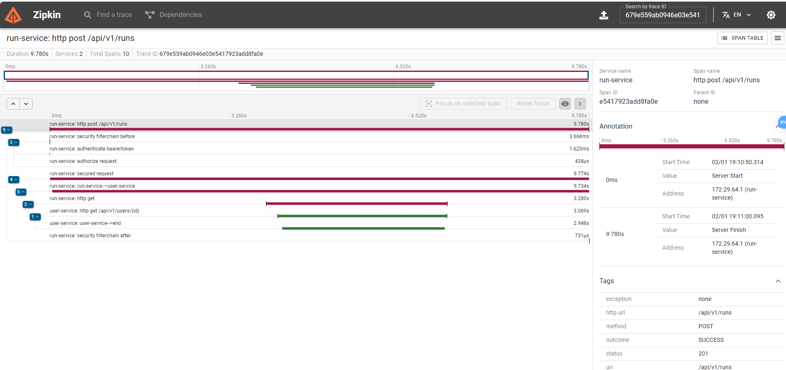

# Project Overview

This project consists of multiple Spring Boot applications and supporting services. Its main goal is to provide a platform for tracking runs and ranking users based on their performance.

- **`run-service`**: Manages operations regarding run tracking. Every time a run is posted, that is published in a Kafka topic. Postgres is used to store the runs.
- **`user-service`**: Manages operations related to the users of the application. Postgres is used to store the users.
- **`statistics-service`**: Consumes Kafka topic for new runs, updates the corresponding user's points statistics and publish a notification in a  Kafka topic regarding the current user ranking among all users. Postgres is used to store the point statistics.
- **`notification-service`**: Consumes Kafka topic for new ranking notifications. Persists the notification in a MongoDB database and notifies the user.
- **Discovery Server (Eureka)**: Registers and discovers services.
- **Gateway Server**: Routes requests to the appropriate services.
- **Configuration Server**: Centralizes configuration for all services.

#### Technologies
- **Spring Boot**: Framework for creating standalone Java applications.
- **Eureka**: Service discovery server.
- **Config Server**: Centralized configuration.
- **Kafka**: Distributed event streaming platform.
- **Zipkin**: Distributed tracing system. By collecting data from the spring boot applications that are using micrometer.
- Spring Security and JWT: Security and authentication.
- **OpenApi**: API documentation.
- **Docker**: Containerization platform.
- **Postgres**: Relational database.
- **MongoDB**: NoSQL database.
- **Java 21**, **Maven**

#### Other Project details
- The dbs persist data in the volume `data` folder after restart.
- Access mongoDB with: `http://localhost:8081/` and the credentials `newuser` and `newpassword`.
- Access the service open API documentation through gateway, with eg: `http://localhost:8090/serviceYouTarget/swagger-ui/index.html`, `http://localhost:8090/serviceYouTarget/v3/api-docs`. serviceYouTarget: run-service, user-service, statistics-service, notification-service
- Access actuator endpoints for each service eg: 
   - localhost:xxx/actuator/health
   - localhost:xxx/actuator/metrics
   - localhost:xxx/actuator/metrics/http.client.requests
   - localhost:xxx/actuator/metrics/disk.total
- Access the registered services on Eureka server by: http://localhost:8761/
- The run-service has implemented security with JWT
- Endpoints can be accesses through the Postman collection in the folder `readmeFiles`
- Access Zipkin for tracing by: http://localhost:9411/zipkin/, 


## How to Run the Project

1. Clone the project repository.
2. Install docker desktop (https://docs.docker.com/desktop/setup/install/windows-install/), includes docker compose, start the program and make sure it is running.
3. Start the Docker Compose file:

    ```bash
    docker-compose up
    ```
4. Start all the applications in the following order:
  - Config-server (Each application configuration is accessible through eg: 'curl http://localhost:8888/run-service/default')
  - Eureka
  - Gateway
  - `run-service`
  - `user-service`
  - `statistics-service`
  - `notification-service`
5. Access the services through the gateway, eg: `http://localhost:8090/run-service/swagger-ui/index.html`
6. Creating private and public keys
   Create private key
   ```bash
   openssl genrsa -out keypair.pem 2048
    ```
   Create public key
    ```bash
   openssl rsa -in keypair.pem -pubout -out public.pem
    ```
   Private key in format pem
    ```bash
   openssl pkcs8 -topk8 -inform PEM -outform PEM -nocrypt -in keypair.pem -out private.pem
   ```
   file keypair.pem no longer is needed